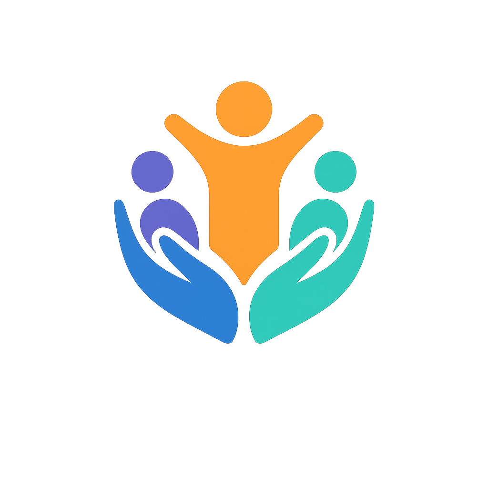
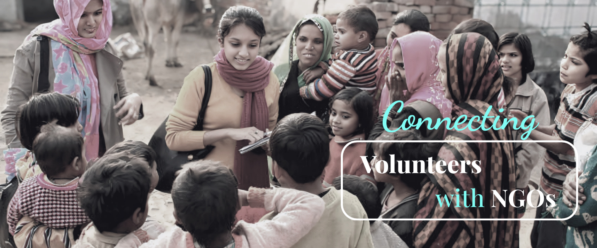

# 🌟 VolunteerVerse - Volunteers Coordination Platform

<div align="center">
  
  
  **Connecting hearts, Creating impact, Building communities**
  
  A modern platform that bridges the gap between passionate volunteers and meaningful opportunities.

  [](https://volunteers-verse.vercel.app/)
  [](https://github.com/Aryan02004/VolunteerVerse)
</div>

---

## ✨ Features

🎯 **Smart Matching** - Find volunteer opportunities that match your interests and skills  
🌍 **Community Impact** - Connect with NGOs and make a real difference  
📊 **Track Progress** - Monitor your volunteering History

🤝 **User-Friendly** - Intuitive interface designed for seamless experience  
🔐 **Secure Platform** - Built with modern authentication and security practices

## 🚀 Quick Start

### Prerequisites
- Node.js 18+ 
- npm or yarn

### Installation

1. **Clone the repository**
   ```bash
   git clone https://github.com/Aryan02004/VolunteerVerse.git
   cd VolunteerVerse
   ```

2. **Install dependencies**
   ```bash
   npm install
   ```

3. **Start development server**
   ```bash
   npm run dev
   ```

4. **Open your browser**
   Navigate to [http://localhost:3000](http://localhost:3000)

## 🛠️ Tech Stack

- **Frontend:** Next.js 15, React 19, TypeScript
- **Styling:** Tailwind CSS, Shadcn/ui
- **Database:** Supabase
- **Authentication:** Supabase Auth
- **Deployment:** Vercel

## 📱 Screenshots

<div align="center">
  
</div>

## 🤝 Contributing

We welcome contributions! Please feel free to submit a Pull Request.

---

<div align="center">
  <p>Made with ❤️ by <a href="https://github.com/Aryan02004">Aaryan</a></p>
  <p>⭐ Star this repo if you found it helpful!</p>
</div>
